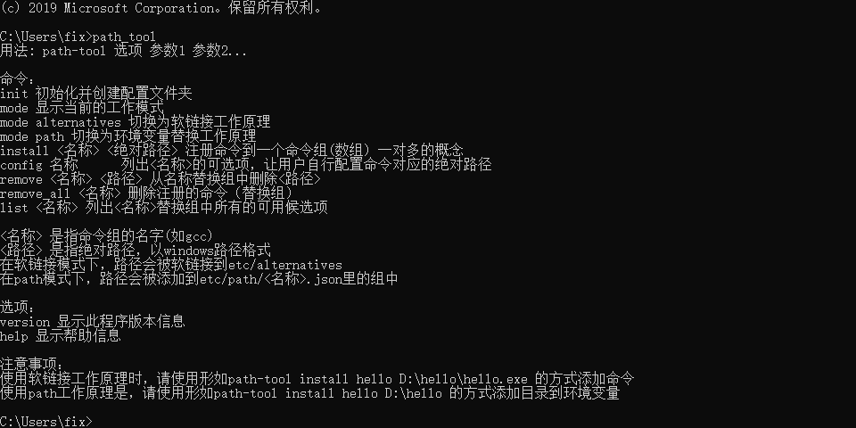

# path-tool
使用nim语言实现的windows系统下的自动化环境变量配置工具(仿linux的update-alternatives)
# 使用方法
## 环境变量配置
1. 把path_tool.exe添加到path环境变量(用户) `记得移除可能存在干扰的选项` \
建议的操作建立环境变量 `PathTool` 并设置值如 `D:\Desktop\path-tool` \
在` path` 里面添加 `%PathTool%` 然后再任意路径下打开cmd，输入 `path_tool` 一切正常的话，应该会有下面的输出

## 初始化
```
path_tool init
```
初始化完毕会向用户环境变量添加一个 `PathToolAlternative` 的变量，这个路径指向软链接模式的工作目录
## 切换模式
1. path工作模式
```
path_tool mode path
```
2. 软链接工作模式
```
path_tool mode alternatives
```
## 在软链接模式下使用
```
path_tool mode alternatives
```
2. 安装exe到命令组
```
path_tool install <名称> <exe的完整绝对路径>
```
如
```
path_tool install tool D:\tool1.exe
```
## 在path模式下使用
```
path_tool mode path
```
2. 安装路径到命令组
```
path_tool install java D:\java8\bin
path_tool install java D:\java11\bin
```
此时你的用户环境变量会多一个叫做 `java` 的变量，里面存放着你要切换并使用的 `java版本`的绝对路径 \
3. 手动在 `path` 变量里添加 `%java%` 注意:最好不要和 `%PathToolAlternative%` 一起使用
4. 切换版本
```
path_tool config java
```
此时软件会询问你要用哪个版本，你输入对应的序号就可以切换了
5. 新开一个cmd，输入java看一下版本信息变了没
6. 如果要安装其他开发工具的多版本工作，请重复以上的操作
## 效果展示


# 注意事项
路径里面不能有特殊符号和空格